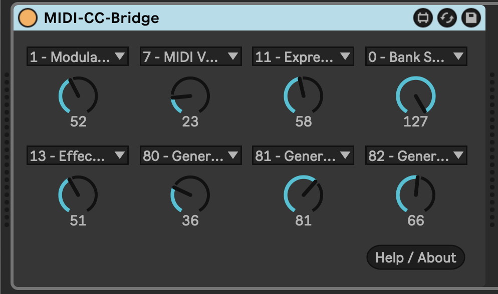
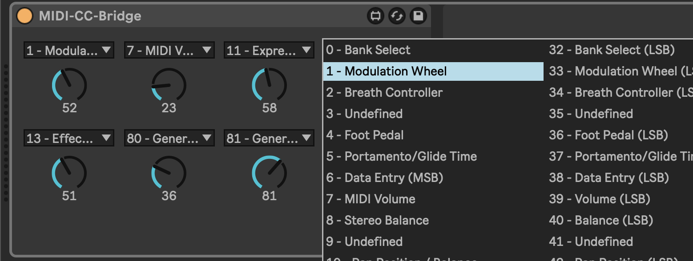

# m4l-MIDI-CC-Bridge

## Connect your control surface to MIDI CC Output

This is a Max For Live MIDI device that allows you to use a control surface like [Knobbler](https://plugins.steinkamp.us/m4l-Knobbler4) to send MIDI CC output, for example to an external synthesizer or effects module.

### Changelog

Direct download links below.

- [v1](https://github.com/zsteinkamp/m4l-KeyStepper/raw/main/frozen/MIDI-CC-Bridge.amxd) - 2025-06-07 - Initial release.

## Installation / Setup

If you just want to download and install the device, then go to the [Releases page](https://github.com/zsteinkamp/m4l-KeyStepper/releases) and download the newest .amxd file there. You can also download it directly via the links in [_Changelog_](#changelog).

## Usage

Add the device to a MIDI track. Each dial can have a different MIDI CC assigned.

Choose an output for the channel.

## TODOs

- ...
